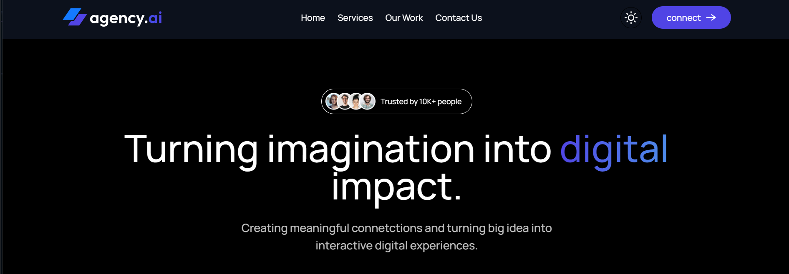

<div align="center">
  <br />
      
    </a>
  <br />

   <div>
    
    
    
    
  </div>

  
   <h3 align="center">Agency.ai Website</h3>
   </div>

Agency.ai is a modern, responsive, and dark-mode-ready website for a digital agency. It showcases services, portfolio, and team members using **React**, **Tailwind CSS**, and **Vite**.

---


## <a name="introduction">🤖 Introduction</a>

**Agency.ai** is a modern digital agency website built with **React.js** for the user interface, **Vite** for fast bundling, and **Tailwind CSS** for styling. The site showcases services, portfolio projects, team members, and includes a dark/light mode toggle for a sleek, modern look.

It features a fully responsive layout, smooth scrolling navigation, and reusable React components, making it easy to customize and expand.

## <a name="tech-stack">🌟 Features</a>

- Fully responsive design for all screen sizes
- Dark and light mode toggle
- Smooth scrolling navigation
- Services section with animated cards
- Portfolio/works showcase
- Team section with profile images
- Contact form integration ready
- Modern UI using Tailwind CSS


---


## <a name="tech-stack">⚙️ Tech Stack</a>

- **[Appwrite](https://appwrite.io/)** is an open-source Backend-as-a-Service (BaaS) platform that provides developers with a set of APIs to manage authentication, databases, storage, and more, enabling rapid development of secure and scalable applications.

- **[React.js](https://react.dev/reference/react)** is a JavaScript library developed by Meta for building user interfaces. It allows developers to create reusable UI components that manage their own state, leading to more efficient and predictable code. React is widely used for developing single-page applications (SPAs) due to its virtual DOM that improves performance and ease of maintenance.

- **[React-use](https://github.com/streamich/react-use)** is a collection of essential React hooks that simplify common tasks like managing state, side effects, and lifecycle events, promoting cleaner and more maintainable code in React applications.

- **[Tailwind CSS](https://tailwindcss.com/)** is a utility-first CSS framework that provides low-level utility classes to build custom designs without writing custom CSS, enabling rapid and responsive UI development.

- **[Vite](https://vite.dev/)** is a modern build tool that provides a fast development environment for frontend projects. It offers features like hot module replacement (HMR) and optimized builds, enhancing the development experience and performance.


## <a name="quick-start">🤸 Quick Start</a>

Follow these steps to set up the project locally on your machine.

**Prerequisites**

Make sure you have the following installed on your machine:

- [Git](https://git-scm.com/)
- [Node.js](https://nodejs.org/en)
- [npm](https://www.npmjs.com/) (Node Package Manager)

**Cloning the Repository**

```bash
git clone https://github.com/Yeab-G/Agency-Website.git
cd Agency-Website

```

**Installation**

Install the project dependencies using npm:

```bash
npm install
```

**Running the Project**

```bash
npm run dev
```


